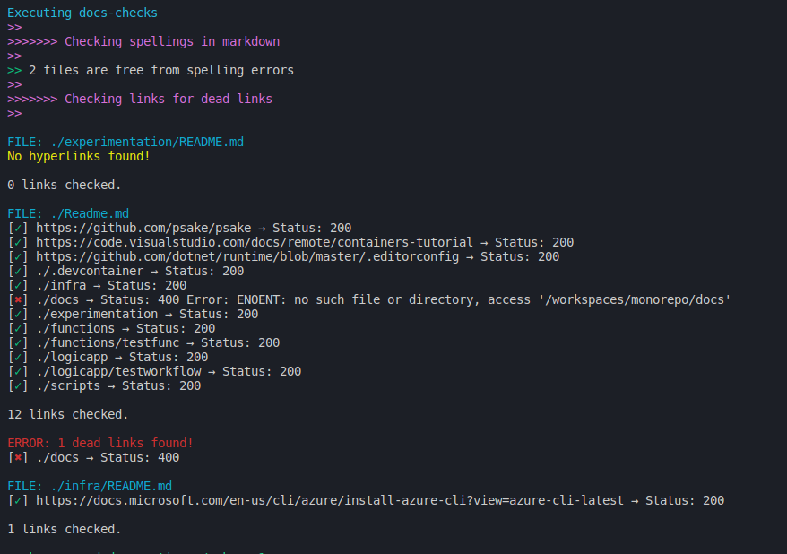

# How to automate simple checks

If you want to automate some checks on your markdown documents, there are several tools that you could leverage. For example:

- [Code Analysis / Linting](../../code-reviews/recipes/Markdown.md#code-analysis-linting)
  - [markdownlint](../../code-reviews/recipes/Markdown.md#markdownlint) to verify markdown syntax and enforce rules that make the text more readable.
  - [markdown-link-check](https://github.com/tcort/markdown-link-check) to extract links from markdown texts and check whether each link is alive (200 OK) or dead.
  - [proselint](../../code-reviews/recipes/Markdown.md#proselint) to check for jargon, spelling errors, redundancy, corporate speak and other language related issues.
  - [write-good](../../code-reviews/recipes/Markdown.md#write-good) to check English prose.
  - [Docker image for node-markdown-spellcheck](https://github.com/tmaier/docker-markdown-spellcheck), a lightweight docker image to spellcheck markdown files.

- [VS Code Extensions](../../code-reviews/recipes/Markdown.md#vs-code-extensions)
  - [Write Good Linter](../../code-reviews/recipes/Markdown.md#write-good-linter) to get grammar and language advice while editing a document.
  - [markdownlint](../../code-reviews/recipes/Markdown.md#markdownlint-extension) to examine markdown documents and get warnings for rule violations while editing.

- Automation
  - [pre-commit](https://pre-commit.com/) to use Git hook scripts to identify simple issues before submitting our code or documentation for review.
  - Check [Build validation](../../code-reviews/recipes/Markdown.md#build-validation) to automate linting for PRs.

Sample output:

## On linting rules

The team needs to be clear what linting rules are required and shouldn't be overridden with tooling or comments. The team should have consensus on when to override tooling rules.
